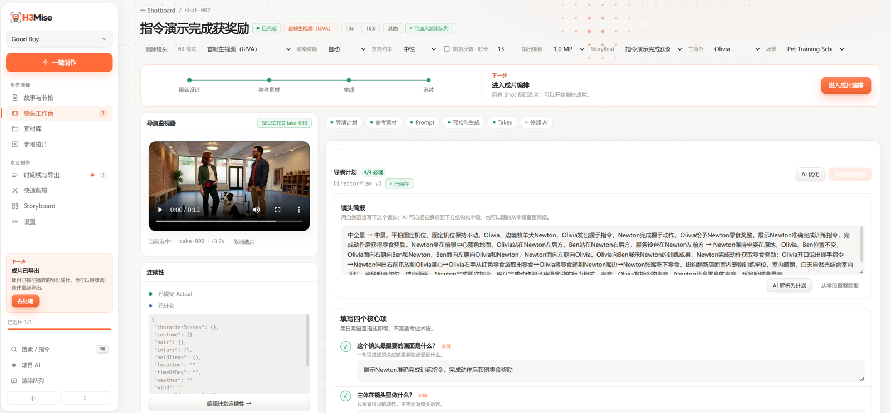
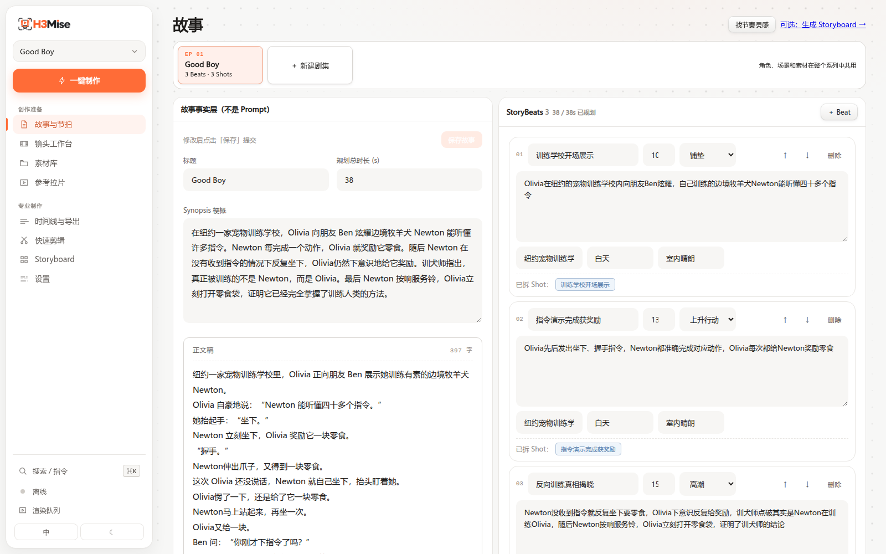
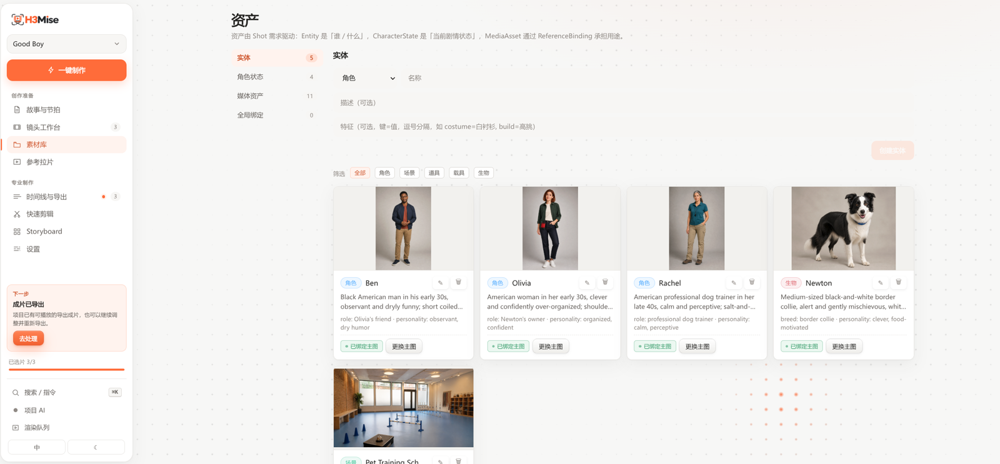

<p align="center">
  
</p>

<p align="center">
  <a href="LICENSE"></a>
  
  
</p>

<p align="center">
  <a href="README.md">中文</a> · <strong>English</strong> · <a href="README.ja.md">日本語</a>
</p>

# H3Mise — A Local-First AI Video Project Workspace

> **mise** comes from the film term *mise-en-scène* (staging).

> Generation tools produce frames; H3Mise makes sure those frames belong to the same film.

H3Mise is a **local-first, Shot-first, AI-optional** AI video project workspace. It does not compete with generation models on image quality, and it does not try to replace professional editing software. What it does is keep a film's story, assets, Shots, multiple Takes, selections, continuity, render jobs, and timeline in one place — so creators can switch models or Providers and keep building the same project.

A generator usually only needs to finish one task; a long-form video project must remember every decision: which reference image a character uses, why a Shot was redone, which Take was selected among several, what continuity the next shot must carry, and which service a failed job belonged to. Without a project layer, that information scatters across chat histories, web tasks, ComfyUI workflows, and local folders.

That is the layer H3Mise manages:

```text
Story → Narrative skeleton / StoryBeat → (optional Storyboard) → Shot design → Render job → Take history
                                                                        ↓
                                                            Selected → Continuity → Timeline
```



## What it is for

- Producing one AI film with multiple generation tools while keeping project state in one place.
- A Shot gets many versions: keep the Take history and the final choice instead of overwriting files.
- Long videos spanning days: resume whenever with "where am I, why this choice, what's next".
- Keep project, assets, and directorial decisions on your machine, not locked into an online workspace.
- Let ComfyUI, RunningHub, or any future Provider do the generation while one project owns the result.

## What it is not

- **Not a video generation model**: H3Mise does not promise better output, nor can it reduce the model's own randomness.
- **Not a ComfyUI replacement**: ComfyUI still handles local workflow orchestration; H3Mise can use it as the film's Render Provider.
- **Not a professional NLE**: trimming, transitions, loudness normalization, and export serve basic finishing; complex editing still belongs in professional software.
- **Not a mature all-round platform**: the core project pipeline works end to end; experiences like quick editing are still being refined publicly.

## How an AI film gets managed

1. **Define the work**: lay out the logline, full text, and total duration, then split the story into shootable StoryBeats. Skeletons and AI refine the current canonical Beats by default instead of appending a second set.
2. **Optional Storyboard**: review a free 3 / 6 / 9-panel text plan first, then decide whether to call the separate RunningHub image App. Approval connects it to Shotboard; long stories page automatically, with every paid page or panel regeneration confirmed separately.
3. **Build assets and states**: manage characters, creatures, scenes, and reference material, and record character states across the story.
4. **Plan Shots**: per shot, keep duration, aspect ratio, generation mode, primary character, scene, Prompt, and megapixel tier.
5. **Track render jobs**: submit after Preflight; record Provider, task ID, progress, failure reason, and elapsed time so a paid retry is never mistaken for a free one.
6. **Manage Takes and selections**: every generation of the same Shot is an independent Take; videos generated elsewhere can be imported as Candidate Takes. Keep candidate, selected, and rejected states; never overwrite old results with new files.
7. **Pass continuity**: read the Selected Take's last frame and actual state, and hand characters, animals, props, and spatial relationships to the next shot.
8. **Assemble and deliver**: place Selected Takes on the timeline, do necessary trimming, transitions, loudness normalization, and export locally.

## Good Boy bundled example

The repo ships a ~40-second sitcom project, **Good Boy**: Olivia shows off Newton, a border collie who understands many commands — until the trainer realizes it's Olivia who has been trained. The example includes the full story, character and creature assets, scene references, shot design, and continuity data; open it, modify it, and keep generating.





## Key capabilities

- **Work-level data model**: story, assets, CharacterState, Shot, Take, continuity, and timeline have explicit relations rather than being a pile of unlinked files.
- **Optional Storyboard**: free 3 / 6 / 9-panel text plans with pagination and explicitly confirmed image generation. Approval reuses or creates the corresponding Shots and binds panel images as references; repeated approval is idempotent.
- **Narrative skeletons**: built-in 3 / 6 / 9-segment pacing structures restructure the current canonical Beats by default instead of appending another set. AI reads and atomically refines current Beats, then creates only missing Shots; local matching still works without AI.
- **Director-style translation**: familiar work names, genres, and eras only resolve into generic director attributes, then inject medium, production design, lighting, performance, camera, and editing direction into H3Mise AI, Storyboard, and the final H3 Prompt; the model is never asked to copy an original work's characters or locations.
- **Shot/Take separation**: a Shot holds directorial intent; every generation creates a new Take; videos generated elsewhere can enter a Shot as Takes too, so reworks and tool swaps never erase history or the rationale behind a choice.
- **Persistent render queue**: keeps Provider task IDs, status, elapsed time, and failure stage; when the provider succeeds but local state is broken, it reconciles the existing task instead of submitting a new paid job.
- **Replaceable Providers**: a project can explicitly use ComfyUI Local, RunningHub AI App, or offline Mock; switching backends does not require rebuilding story and shot structure.
- **Continuity workflow**: after selection, guides recording the actual last-frame state, and carries characters, creatures, props, and spatial relationships into the next Shot.
- **Assets and character states**: people, animals, robots, and personified creatures can all be primary characters with bound CharacterState.
- **Multimodal AI assistance**: reads reference images or last frames when polishing shot design and continuity; vision failures fall back to text context, and everything still works without any AI configured.
- **Generation parameter archival**: records generation mode, reference assets, duration, aspect ratio, and megapixel tier (`0.6 / 0.8 / 1.0 / 1.2 MP`) so each Take's provenance is understandable.
- **Paid-job protection**: runs local Preflight before real renders, and uses the active-job lock plus capability checks to reduce bad and duplicate submissions.
- **One-click reconciliation**: paid-task estimates include Shots that uncovered Beats will create. Candidate Takes and active jobs stop a new run until review or reconciliation, preventing blind resubmission.
- **Basic local finishing**: Selected Takes can go to the timeline for trimming, transitions, and loudness normalization, then export via FFmpeg — a delivery path, not the product's main differentiator.
- **Local-first**: project data and media live under `H3MISE_HOME`; a project lock prevents concurrent tab sessions from operating on different projects simultaneously.

## Quick start

Requires Node.js ≥ 22 (with `node:sqlite`) and FFmpeg.

```bash
pnpm install

# Development
pnpm dev:server   # API: http://127.0.0.1:4789
pnpm dev:web      # UI: http://127.0.0.1:5188

# Production
pnpm --filter @h3mise/web build
pnpm start
```

### Windows (PowerShell)

Install [Node.js 22+](https://nodejs.org/) first, then set up pnpm and FFmpeg in PowerShell:

```powershell
corepack enable
corepack prepare pnpm@11.7.0 --activate
choco install ffmpeg -y

node --version
pnpm --version
ffmpeg -version
ffprobe -version
pnpm install
pnpm build
pnpm start
```

Without Chocolatey you can install FFmpeg yourself, but make sure both `ffmpeg.exe` and `ffprobe.exe` are on `PATH`. The default project directory is `%USERPROFILE%\.h3mise`; media accepts drive-letter absolute paths as well as LAN share paths such as `\\server\share\file.mp4`.

On the Projects page, install the bundled demo. The project is copied into your local data directory, so edits never affect the pristine copy in the repo.

> Not ready for real generation? Use the Mock Provider to run the whole pipeline offline; for local generation, import your own API-Format workflow following the [ComfyUI guide](ComfyUI.md).

## Configuration

Most configuration lives in the **Settings** page.

| Setting | Description |
| --- | --- |
| **RunningHub API Key** | Needed for real rendering; the `RUNNINGHUB_API_KEY` environment variable also works |
| **AI App** | Paste your own AI App ID and node mapping, or auto-detect workflow nodes |
| **Storyboard image App** | Optional, separate RunningHub AI App; reuses the same API Key but keeps its own App ID, Prompt / Size / Layout Image node mapping, size values, and cost estimate |
| **ComfyUI Local** | Import `workflow_api.json`, inspect input mappings, and probe the local service; see [ComfyUI.md](ComfyUI.md) |
| **Built-in AI** | Configure an OpenAI-compatible model via `AI_BASE_URL / AI_API_KEY / AI_MODEL` |

Other optional environment variables: `PORT` (default `4789`), `H3MISE_HOME` (default `~/.h3mise`), `H3MISE_PROVIDER=mock|runninghub`, `H3MISE_SERVE_WEB=0`.

If you're unfamiliar with the Providers, let your coding assistant read [AGENTS.md](AGENTS.md) first; it documents RunningHub's safe configuration, automatic node detection, and first low-cost verification. ComfyUI's agent onboarding protocol, Profile mapping, and troubleshooting live in [ComfyUI.md](ComfyUI.md). An assistant must never start a real render without confirmation.

## Pages

- **Quick Edit (in progress)**: a simplified entry point exists, but editing still jumps to the professional timeline — not yet a self-contained beginner loop.
- **Story**: story facts, full text, duration, and canonical StoryBeats; skeletons and AI refine in place, and uncovered Beats can create missing Shots with minimum DirectorPlans.
- **Storyboard (optional)**: free text-panel editing and explicitly confirmed image generation; approval connects it to Shotboard, or it can be skipped entirely.
- **Shots**: Shotboard and Director Desk; bind assets, design shots, generate prompts, preflight, and render.
- **Assets**: characters, creatures, scenes, character states, media assets, and reference bindings.
- **Timeline**: trimming, transitions, and local export.
- **Settings**: video Provider, optional Storyboard image Provider, director style, built-in AI, workflow node detection, and environment checks.

## Repository layout

```text
shared/   # Domain types shared by server and web
server/   # Node + Hono + SQLite + FFmpeg + Provider + RenderQueue
web/      # Vue 3 frontend
demo/     # Installable example projects
scripts/  # Ops and verification scripts
```

Stack: Vue 3 + TypeScript + Vite · Node.js + Hono · SQLite (`node:sqlite`) · FFmpeg · SSE

## License

H3Mise is open source under the [MIT License](LICENSE). Copyright © 2026 Gordon.
